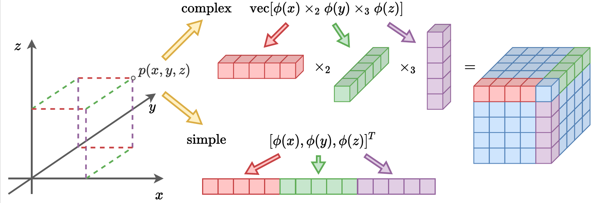

# Trading Positional Complexity vs Deepness in Coordinate Networks
### [Project Page]() | [Paper]()

[Jianqiao Zheng](https://github.com/osiriszjq/),
[Sameera Ramasinghe](),
[Xueqian Li](https://lilac-lee.github.io/),
[Simon Lucey](https://www.adelaide.edu.au/directory/simon.lucey) 
The University of Adelaide

This is the official implementation of the paper "Trading Positional Complexity vs Deepness in Coordinate Networks".

#### Illustration of different methods to extend 1D encoding

    
    
## Google Colab
 
If you want to try out our new complex encoding, we have written a [Colab](https://colab.research.google.com/drive/1RNBW9RbOjOmAm2B1DtzdpuR1N03hyaAv) with the following experiments:
* simple encoding for 2D image reconstuction with separable coordinates
* complex encoding for 2D image reconstuction with separable coordinates
* colsed form solution of complex encoding for 2D image reconstuction with separable coordinates. 
